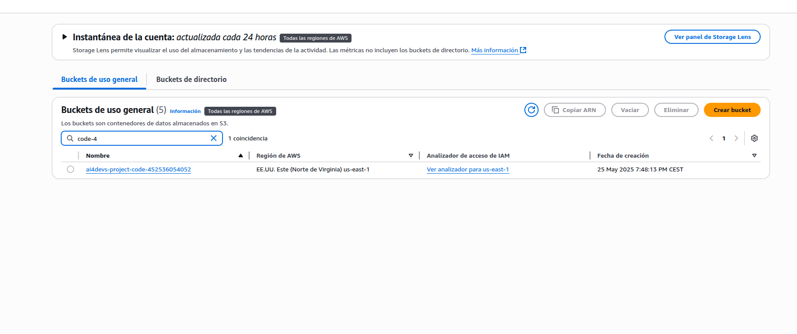
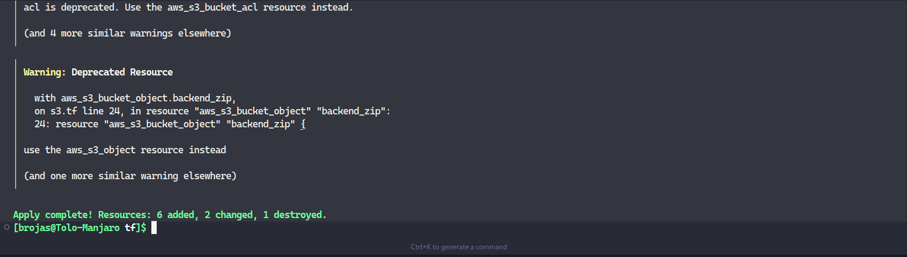
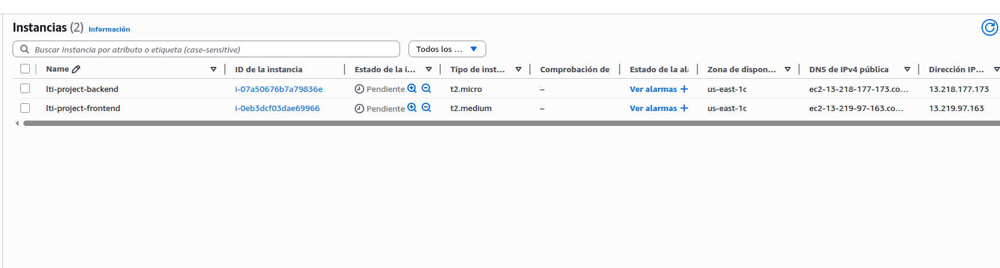
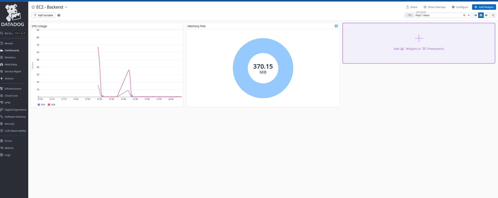

# Implementación de Monitoreo con Datadog en AWS

Este documento describe la implementación exitosa de monitoreo con Datadog en nuestra infraestructura AWS usando Terraform.

## Índice
1. [Configuración del Backend Remoto](#configuración-del-backend-remoto)
2. [Implementación de Datadog](#implementación-de-datadog)
3. [Evidencias de Implementación](#evidencias-de-implementación)

## Configuración del Backend Remoto

Se implementó un backend remoto para el estado de Terraform usando:
- S3 para almacenamiento del estado
- DynamoDB para bloqueo de estado

### Recursos Creados:
- Bucket S3: `ai4devs-terraform-state-{account-id}`
- Tabla DynamoDB: `ai4devs-terraform-locks`



## Implementación de Datadog

### Pasos Realizados:

1. **Configuración de Permisos IAM**
   - Modificación de roles para acceso a Secrets Manager
   - Permisos para acceder al secreto de Datadog

2. **Scripts de Usuario**
   - Instalación automática del agente Datadog
   - Configuración de región EU
   - Manejo de API Keys desde Secrets Manager

3. **Security Groups**
   - Reglas para comunicación con Datadog
   - Puertos necesarios habilitados (443/TCP, 123/UDP)

4. **Variables de Terraform**
   - Configuración de ARN del secreto
   - Variables para región y configuración de Datadog

### Despliegue Exitoso

El despliegue se realizó correctamente como se muestra en la siguiente captura:



### Instancias Desplegadas

Las instancias EC2 se desplegaron correctamente con la configuración de Datadog:



## Monitoreo en Datadog

El agente de Datadog está recolectando métricas correctamente:



### Métricas Recolectadas:
- CPU Usage
- Memoria
- Disco
- Red
- Procesos
- Sistema

## Verificación del Agente

El agente está funcionando correctamente y enviando métricas a Datadog. Algunos datos importantes:

```
Checks Metric Sample: 2,385
Series Flushed: 2,236
Number Of Flushes: 8
```


## Mantenimiento

Para verificar el estado del agente:
```bash
sudo datadog-agent status
sudo datadog-agent health
```

Para ver los logs del agente:
```bash
sudo tail -f /var/log/datadog/agent.log
```
