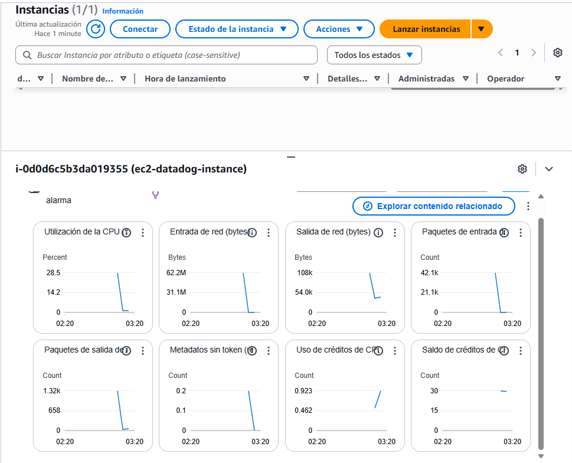
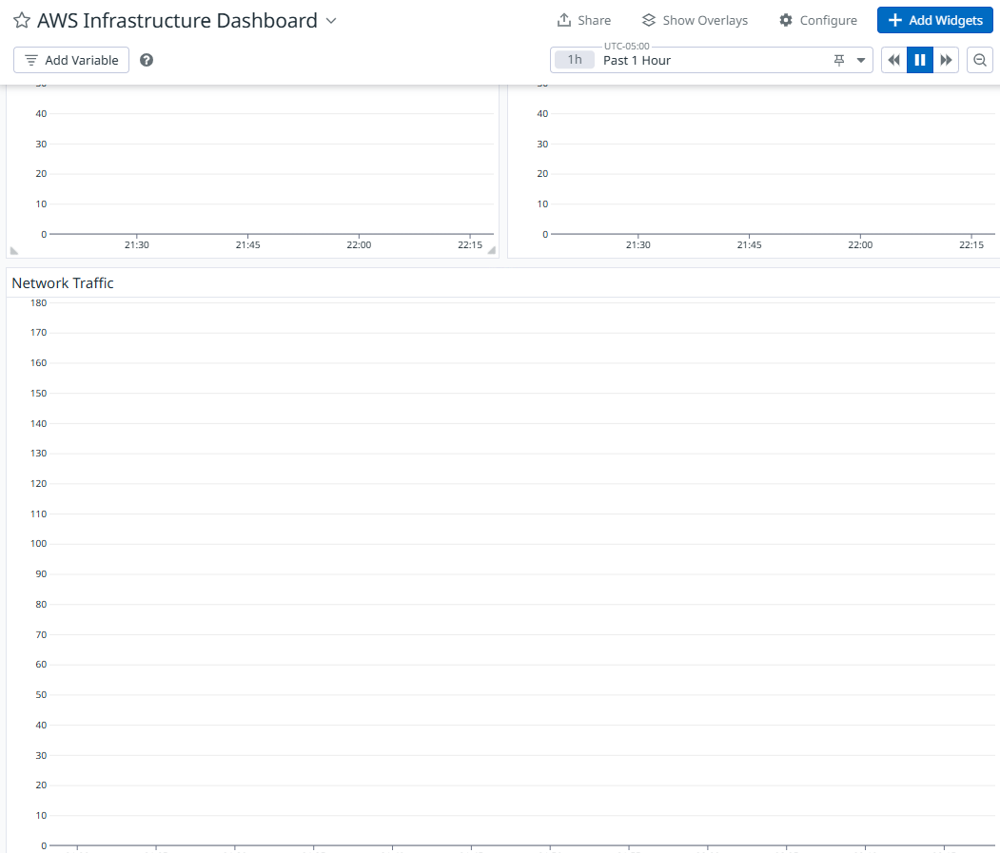

# Infraestructura AWS con Monitoreo Datadog

Este proyecto implementa una infraestructura en AWS con monitoreo utilizando Datadog, todo gestionado con Terraform.

## Cambios Realizados

1. **Integración AWS-Datadog**:
   - Configuración del proveedor Datadog en Terraform
   - Instalación del agente Datadog en la instancia EC2
   - Creación de dashboard para monitoreo

2. **Componentes Implementados**:
   - Instancia EC2 con Amazon Linux 2023
   - Security Group para la instancia
   - Dashboard de Datadog con métricas clave:
     - Uso de CPU
     - Uso de Memoria
     - Tráfico de Red

3. **Desafíos Encontrados y Soluciones**:
   - **Desafío 1**: AMI ID no válido
     - Solución: Actualizado a un AMI válido de Amazon Linux 2023
   - **Desafío 2**: Dimensiones de widgets en Datadog
     - Solución: Ajustado el layout para cumplir con las restricciones del grid
   - **Desafío 3**: Atributo deprecado en Datadog
     - Solución: Eliminado el atributo `is_read_only` deprecado

## Capturas de Pantalla

### Dashboard de Datadog

*Dashboard principal con métricas de la instancia EC2*

### Métricas en Tiempo Real

*Métricas de CPU, Memoria y Red en tiempo real*

## Prerrequisitos

- Cuenta AWS con credenciales configuradas
- Cuenta Datadog con API Key y App Key
- Terraform instalado (versión >= 1.0.0)

## Configuración

1. Clona este repositorio
2. Configura tus credenciales de AWS:
   ```bash
   aws configure
   ```
3. Crea un archivo `terraform.tfvars` con tus credenciales de Datadog:
   ```hcl
   datadog_api_key = "tu-api-key"
   datadog_app_key = "tu-app-key"
   ```

## Uso

1. Inicializa Terraform:
   ```bash
   terraform init
   ```

2. Revisa los cambios planificados:
   ```bash
   terraform plan
   ```

3. Aplica la configuración:
   ```bash
   terraform apply
   ```

## Limpieza

Para destruir la infraestructura:
```bash
terraform destroy
```

## Notas Importantes

- Las claves de API son sensibles y no deben compartirse
- La instancia EC2 usa una AMI de Amazon Linux 2023
- El dashboard se configura automáticamente en Datadog 


