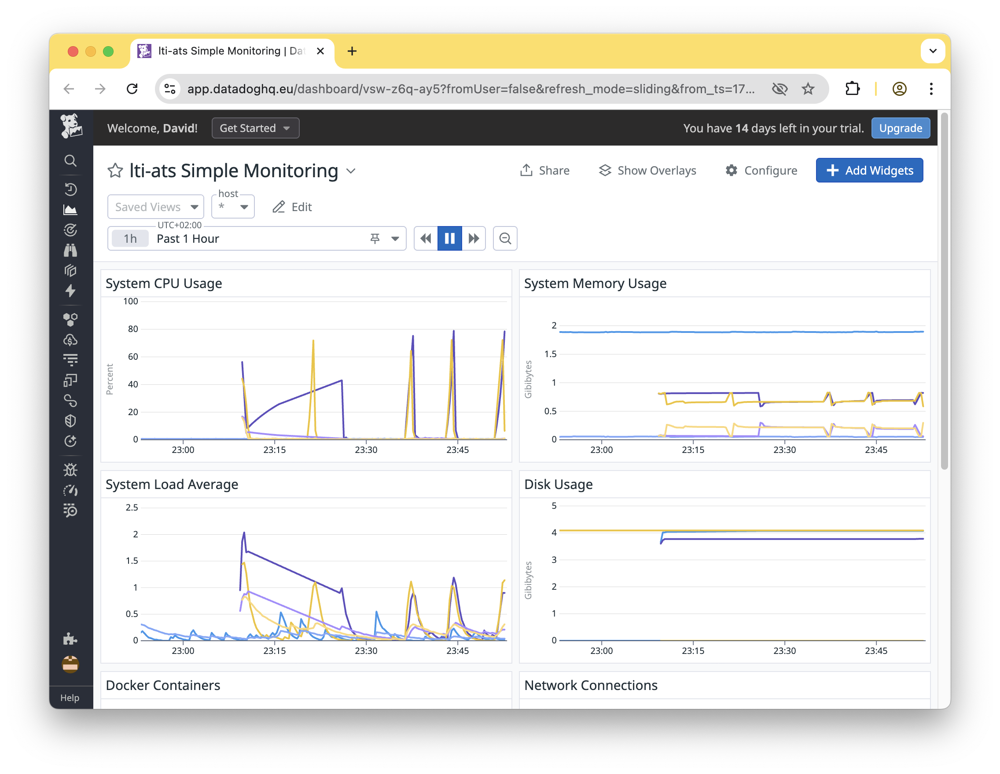

# Terraform for LTI ATS

## Explanation of the changes made

Changed the terraform code to use the eu-north-1 region and the t3.micro instance type (t2.micro doesn't exist in eu-north-1).

Added datadog agent to the backend and frontend instances.

Added terraform code to set up an AWS integration for Datadog and create a simple dashboard.

The prompts can be found in the [prompts](../prompts/datadog-aws-prompts.md) folder.

## Screenshots of the dashboard in Datadog

## Any challenges encountered and how you resolved them

The agent-generated terraform code for the AWS integration was not working. I had to use Datadog's console to generate some HCL code, and then Claude to fix it.  The root cause (like so often) was that Claude didn't work consistently with the _current_ version of the Datadog API.

